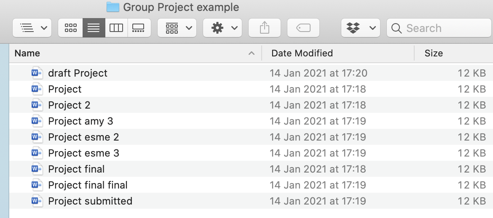

## What is version control?

Imagine you are collaborating with your university group on a project. Before google drive/docs/sheets, how would you have collated everyone's contributions together?

It would not be unusual to end up in a scenario where you're unsure of what's in each version, like this:

In scenarios like this, several people are editing several copies of one original document resulting in duplicates. This can happen if people are working at the same time or asynchronously off of old copies. To check everything makes sense together (and definitely before submitting), someone would have had to go through and combine the edits together. This is difficult because they may not know which is the most recent copy of each paragraph. Information often gets lost or does not fit together properly.

These challenges are not dissimilar to those which software teams face when collaborating in a code base:

- How do you incorporate each others' edits into your own copy?
- How can you all make edits at the same time?
- How do you know that you are on the most recent version?
- How do you revert back to a previous version if you make a mistake?
- If you find a bug, how can you work out which version it first appeared in?
- How can you tell who contributed each part?

Version control systems therefore aim to solve these challenges. They provide a way for teams to work on projects together, combine their edits into a single up to date version and provide a way to navigate through all the previous edits. Version control is not unique to software: it can be used for books, research papers, data sets or anything which either changes over time or are written by groups.

Let's consider your Prework game projects for a concrete example of how version control can help. Some pairs found themselves copying the code each time to save an old version which could be referred back to if they broke the current copy - version control allows you to easily access old copies. Some pairs experienced the issue that different individuals couldn't edit the game simultaneously - version control provides an easy way to collaborate on separate copies and then combine your changes together again.

### Optional further reading

For more information about version control generally, look at [Atlassian's page](https://www.atlassian.com/git/tutorials/what-is-version-control). A more technical discussion of types of verison control system [can be found in the git documentation](https://git-scm.com/book/en/v2/Getting-Started-About-Version-Control) for those with a deeper interest.
